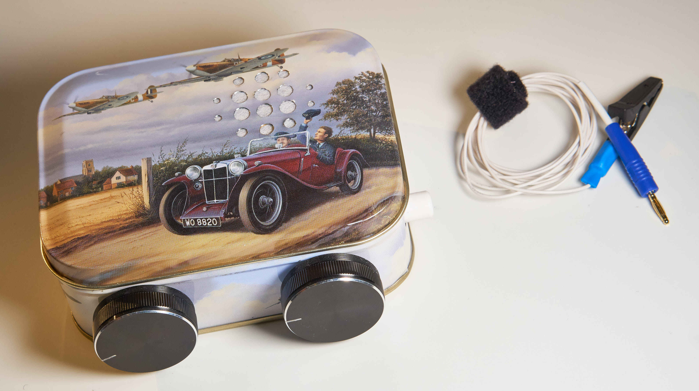
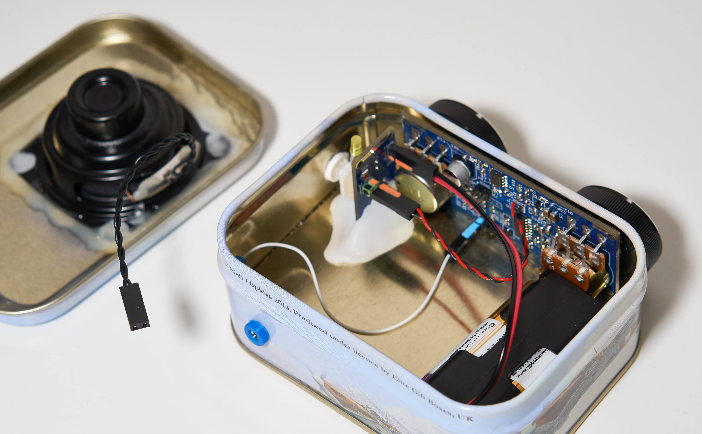
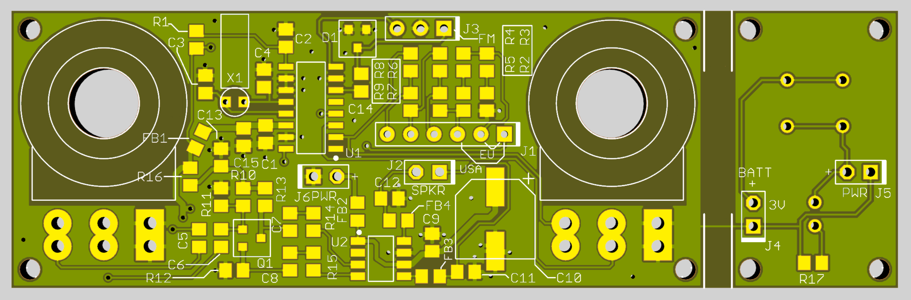
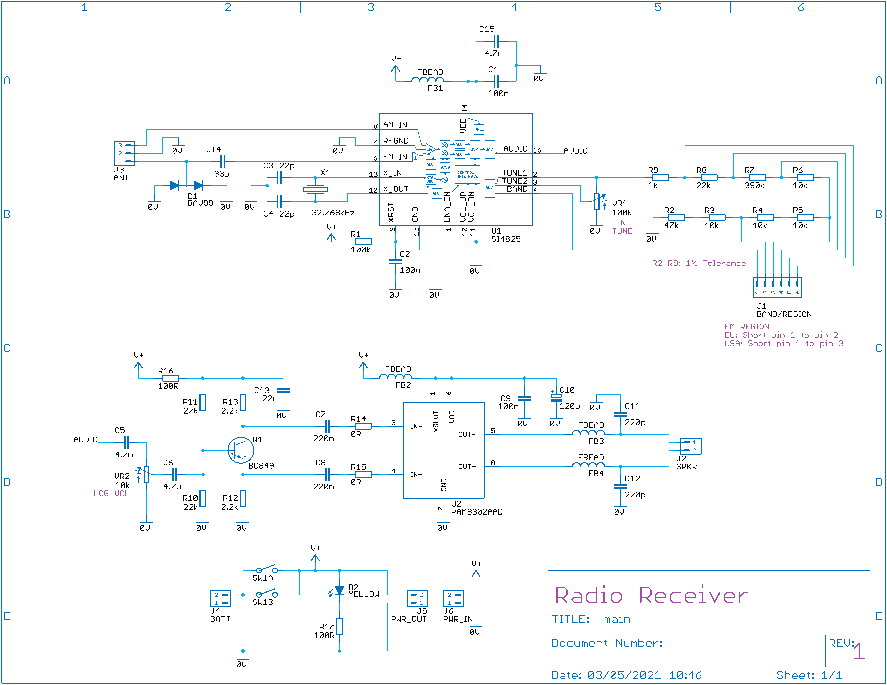
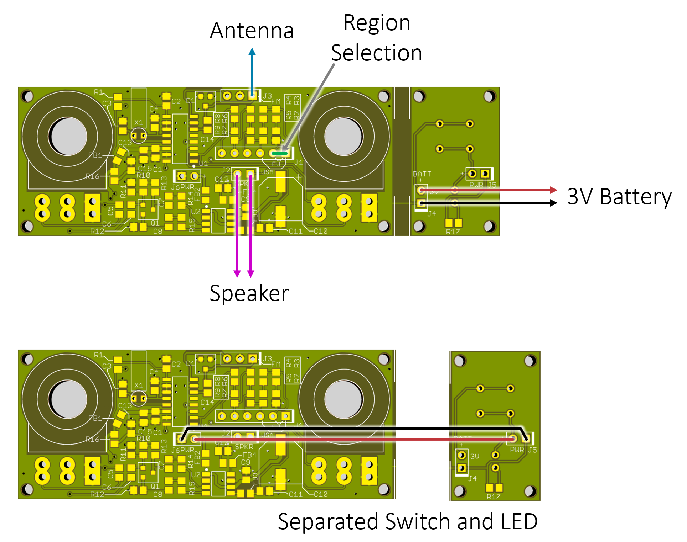
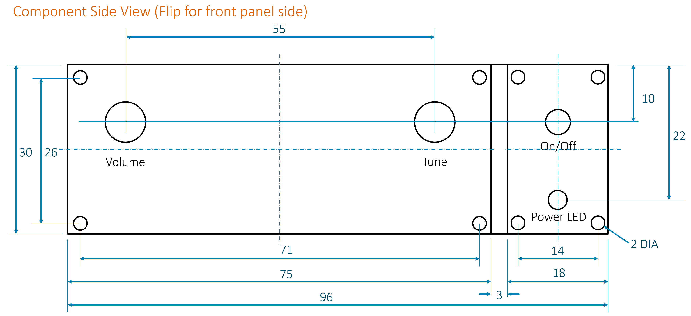

# Simple FM Receiver

This repository contains the detail to construct this simple FM radio receiver:

Internals:

This is the top view of the circuit board:

To order, submit the export-gerber-radio-v1.zip file to any PCB manufacturer; it will cost a few $ to receive several boards back.
You'll need these parts:

**#**|**Mnfr Code**|**Description**|**Identifier**|**Qty**
:-----:|:-----:|:-----:|:-----:|:-----:
1|MCWR08X1003FTL|100k 0805|R1|1
2|MCWR08X4702FTL|47k 0805|R2|1
3|MCWF08P1002FTL|10k 0805|R3, R4, R5, R6|4
4|RK73H2ATTD3903F.|390k 0805|R7|1
5|MCWR08X2202FTL|22k 0805|R8, R10|2
6|MCWR08X1001FTL|1k 0805|R9|1
7|MCWR08X2702FTL|27k 0805|R11|1
8|MCWR08X2201FTL|2.2k 0805|R12, R13|2
9|ERJ6GEY0R00V|0R 0805|R14, R15|2
10|ERJ6ENF1000V|100R 0805|R16, R17|2
11|MMZ2012S601AT000|FBEAD 0805|FB1, FB2, FB3, FB4|4
12|MC0805B104K101CT|100nF 0805|C1, C2, C9|3
13|C0805C220J5GACTU|22pF 0805|C3, C4|2
14|C2012X7R1E475K125AB|4.7uF 0805|C5, C6, C15|3
15|CC0805KRX7R7BB224|220nF 0805|C7, C8|2
16|C0805C221K5GACTU|220pF 0805|C11, C12|2
17|GRM21BR61A226ME51L|22uF 0805|C13|1
18|X32K768L104|32.768kHz|X1|1
19|BAV99|BAV99|D1|1
20|BC849BLT1G|BC849B|Q1|1
21|SI4825-A10-CSR|SI4825|U1|1
22|PAM8302AADCR|PAM8302|U2|1
23|16SVPC100M|100uF 16V|C10|1
24|P160KNP-0QC20B100K|100k Lin Pot|VR1|1
25|P160KNP-0QC20A10K|10k Log Pot|VR2|1
26|PVA1 EE H1 3.5N V2|Switch|SW1|1
27|L-53LYD|LED Yellow|D2|1
28|MP000329|2xAA Batt Holder|J4|1

Here is the circuit diagram:

The assembly diagram is below. Notice that you can cut the PCB into two pieces, if you wish for the power button to be located elsewhere.

If you're fitting the PCB into an enclosure, refer to the diagram here for dimensions/hole locations.

